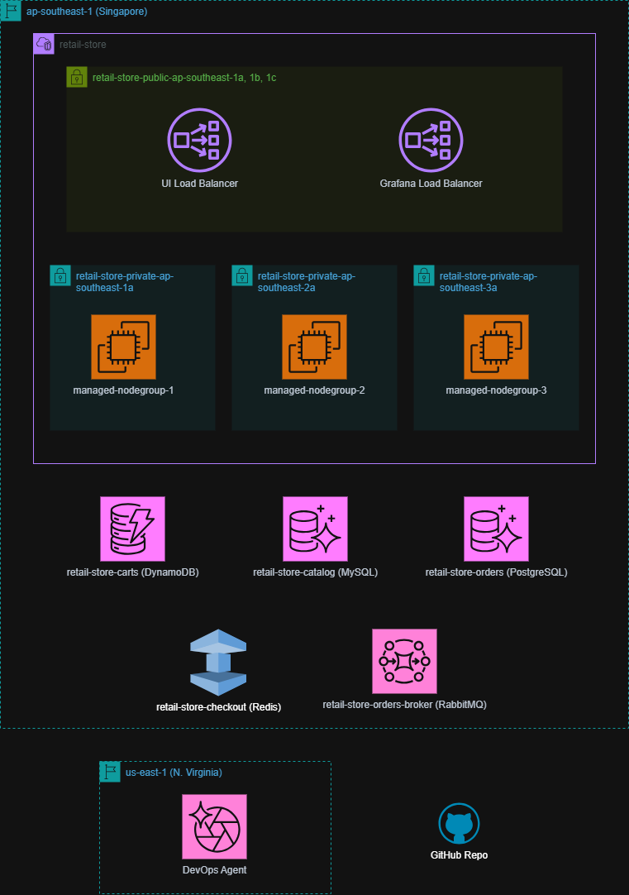

# AWS Resource

## ELB in public subnet
- UI Load Balancer - for ecommerce app
- Grafana Load Balancer - for grafana

## EC2 in private subnet
3 managed node group created with 1 EC2 instance in each group
- managed-nodegroup-1
- managed-nodegroup-2
- managed-nodegroup-3

provisioned by 
```
module "eks_cluster"
...
  eks_managed_node_groups = {
    node_group_1 = {
      name                 = "managed-nodegroup-1"
      instance_types       = [var.node_group_instance_type]
      subnet_ids           = [var.subnet_ids[0]]
      force_update_version = true

      min_size     = 1
      max_size     = 3
      desired_size = 1
    }

    node_group_2 = {
      name                 = "managed-nodegroup-2"
      instance_types       = [var.node_group_instance_type]
      subnet_ids           = [var.subnet_ids[1]]
      force_update_version = true

      min_size     = 1
      max_size     = 3
      desired_size = 1
    }

    node_group_3 = {
      name                 = "managed-nodegroup-3"
      instance_types       = [var.node_group_instance_type]
      subnet_ids           = [var.subnet_ids[2]]
      force_update_version = true

      min_size     = 1
      max_size     = 3
      desired_size = 1
    }
  }
...
```

## Date Store
- DynamoDB for carts : provision by terraform/lib/dependencies/dynamodb.tf
- Aurora PostreSQL for catalog : provision by terraform/lib/dependencies/catalog_rds.tf
- Aurora mySQL for orders : terraform/lib/dependencies/orders_rds.tf
- Redis for checkout : terraform/lib/dependencies/elasticache.tf
- RabbitMQ for order broker : terraform/lib/dependencies/mq.tf

## DevOps Agent
- Workspace for Cloud Engineer to do triage, root cause analysis
- Integrated to GitHub 