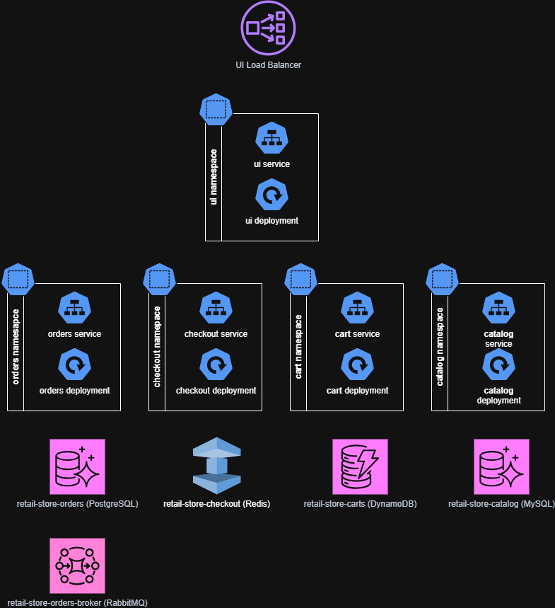

# AWS Resource


## ELB in public subnet
- [UI Load Balancer](../terraform/eks/default/values/ui.yaml)
```
service:
  type: LoadBalancer
  annotations:
    service.beta.kubernetes.io/aws-load-balancer-type: external 
    service.beta.kubernetes.io/aws-load-balancer-scheme: internet-facing
    service.beta.kubernetes.io/aws-load-balancer-nlb-target-type: ip
    service.beta.kubernetes.io/aws-load-balancer-attributes: "load_balancing.cross_zone.enabled=true"
```
- [Grafana Load Balancer](../terraform/eks/default/values/monitoring.yaml)
```
  service:
    type: LoadBalancer
    annotations:
      service.beta.kubernetes.io/aws-load-balancer-scheme: internet-facing
      service.beta.kubernetes.io/aws-load-balancer-internal: "false"
``` 

## EC2 in private subnet
[3 managed node group created with 1 EC2 instance in each group](../terraform/lib/eks/eks.tf)
```
module "eks_cluster"
...
  eks_managed_node_groups = {
    node_group_1 = {
      name                 = "managed-nodegroup-1"
      instance_types       = [var.node_group_instance_type]
      subnet_ids           = [var.subnet_ids[0]]
      force_update_version = true

      min_size     = 1
      max_size     = 3
      desired_size = 1
    }

    node_group_2 = {
      name                 = "managed-nodegroup-2"
      instance_types       = [var.node_group_instance_type]
      subnet_ids           = [var.subnet_ids[1]]
      force_update_version = true

      min_size     = 1
      max_size     = 3
      desired_size = 1
    }

    node_group_3 = {
      name                 = "managed-nodegroup-3"
      instance_types       = [var.node_group_instance_type]
      subnet_ids           = [var.subnet_ids[2]]
      force_update_version = true

      min_size     = 1
      max_size     = 3
      desired_size = 1
    }
  }
...
```

## Date Store
- [DynamoDB for carts](../terraform/lib/dependencies/dynamodb.tf)
- [Aurora PostreSQL for catalog](../terraform/lib/dependencies/catalog_rds.tf)
- [Aurora mySQL for orders](../terraform/lib/dependencies/orders_rds.tf)
- [Redis for checkout](../terraform/lib/dependencies/elasticache.tf)
- [RabbitMQ for order broker](../terraform/lib/dependencies/mq.tf)

# K8s Cluster - Application


- [ui](../src/ui/chart/values.yaml)
- [orders](../src/orders/chart/values.yaml)
- [checkout](../src/checkout/chart/values.yaml)
- [cart](../src/cart/chart/values.yaml)
- [catalog](../src/catalog/chart/values.yaml)

# K8s Cluster - Monitoring


# DevOps Agent + Observability Stack + CI/CD

