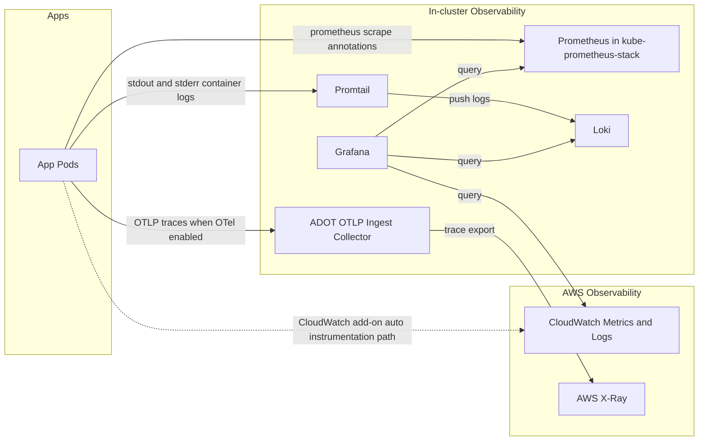

# Observability Flow Review for terraform/eks/default

This document reviews what is installed and how metrics, logs, and traces flow in the EKS default Terraform stack.

## What Is Installed and Enabled

Based on Terraform under terraform/eks/default:

1. CloudWatch Observability add-on: enabled
- Resource: aws_eks_addon.cloudwatch_observability
- File: terraform/eks/default/kubernetes.tf

2. Prometheus and Grafana: enabled
- Resource: helm_release.monitoring
- Chart: kube-prometheus-stack
- File: terraform/eks/default/kubernetes.tf

3. Loki: enabled
- Resource: helm_release.loki
- File: terraform/eks/default/kubernetes.tf

4. Promtail: enabled
- Resource: helm_release.promtail
- File: terraform/eks/default/kubernetes.tf
- Destination: Loki push API in values/promtail.yaml

5. OpenTelemetry app auto-instrumentation: conditional
- Controlled by variable opentelemetry_enabled
- Instrumentation manifest created only when true
- File: terraform/eks/default/opentelemetry.tf

## High-Level Architecture



## Metrics Flow

### In-cluster metrics path

1. Application pods expose metrics endpoints and prometheus scrape annotations through each service Helm chart.
2. kube-prometheus-stack deploys Prometheus and scrapes those endpoints.
3. Grafana queries Prometheus for dashboards.

### Cloud metrics path

1. CloudWatch Observability add-on is installed in the cluster.
2. Grafana is configured with a CloudWatch datasource and has IAM permissions to read CloudWatch.
3. CloudWatch dashboards and metrics can be visualized in Grafana alongside Prometheus metrics.

## Logs Flow

1. Application container stdout and stderr logs are collected by Promtail.
2. Promtail pushes logs to Loki at:
- http://loki.monitoring.svc.cluster.local:3100/loki/api/v1/push
3. Grafana queries Loki for log dashboards.

Notes:
- Loki is configured in SingleBinary mode.
- chunksCache is disabled to avoid oversized memory requests on small worker nodes.

## Traces Flow

### When opentelemetry_enabled is true

1. OpenTelemetry Instrumentation custom resource is created.
2. Auto-instrumented app SDKs export OTLP traces to:
- http://adot-col-otlp-ingest-collector.<adot-namespace>:4318
3. ADOT collector pipeline exports traces to AWS X-Ray.

### CloudWatch add-on interaction

The CloudWatch Observability add-on can also inject telemetry settings into pods, which may overlap with OpenTelemetry Operator settings.
If both are active, exporters can conflict and send traces to unexpected endpoints.

## Metrics and Logs Overlap

This stack has two paths for metrics and potentially two paths for logs. They are not identical by default.

### Metrics overlap

1. Prometheus and CloudWatch overlap partially for infrastructure health signals such as node and pod CPU and memory.
2. Prometheus typically contains richer Kubernetes and application metrics due to scrape labels and higher-cardinality dimensions.
3. CloudWatch typically contains AWS and Container Insights oriented metrics and dimensions.
4. Even when both show similar concepts, metric names, labels, and aggregation windows usually differ.

Conclusion: expect partial overlap, not a one-to-one identical metric set.

### Logs overlap

1. Loki receives logs from Promtail (container stdout and stderr).
2. CloudWatch Observability may also collect container logs.
3. If both are enabled for the same workloads, many log lines can appear in both systems.
4. They can still differ due to parsing, metadata enrichment, multiline handling, and filtering behavior.

Conclusion: often near-duplicate logs for the same workloads, but not guaranteed byte-for-byte identical records.

### Operational guidance

1. Keep both metrics channels when you want Prometheus depth and CloudWatch AWS-native operations views.
2. For logs, choose a primary system if cost and duplication are concerns, or keep dual shipping for resilience/compliance.
3. Use Grafana to query both datasources, but avoid assuming direct metric or log record equivalence between systems.

## Verified Configuration Sources

- CloudWatch add-on: terraform/eks/default/kubernetes.tf
- Prometheus and Grafana Helm release: terraform/eks/default/kubernetes.tf
- Loki Helm release: terraform/eks/default/kubernetes.tf
- Promtail Helm release and Loki endpoint: terraform/eks/default/values/promtail.yaml
- Loki mode and resource tuning: terraform/eks/default/values/loki.yaml
- OTel Instrumentation exporter endpoint: terraform/eks/default/opentelemetry.tf
- OTel enable flag default: terraform/eks/default/variables.tf
- Grafana CloudWatch datasource and dashboards wiring: terraform/eks/default/dashboard.tf

## Quick Validation Commands

Run from a shell with kubectl and helm configured for this cluster.

1. Confirm add-on and releases:
- kubectl get addon -A
- helm -n monitoring list

2. Confirm Promtail destination and Loki health:
- kubectl -n monitoring get cm -l app.kubernetes.io/name=promtail -o yaml
- kubectl -n monitoring get pods -l app.kubernetes.io/instance=loki

3. Confirm app pod telemetry env and annotations:
- kubectl -n ui get deploy ui -o yaml
- kubectl -n ui logs deploy/ui --tail=50

4. Confirm OTel objects if enabled:
- kubectl get instrumentation -A
- kubectl get pods -n opentelemetry-operator-system

5. Compare overlap behavior quickly:
- kubectl -n ui logs deploy/ui --tail=50
- Query the same timeframe in Loki and CloudWatch Logs to compare duplication and metadata differences
- Compare a known app metric series in Prometheus and CloudWatch to confirm naming and label differences

## Command Set: Check Prometheus and CloudWatch Metrics Availability

Use these commands to verify what Prometheus is scraping and what CloudWatch is receiving.

Set context first:

```bash
export REGION=ap-southeast-1
export CLUSTER_NAME=<your-eks-cluster-name>
```

### A) Prometheus: check live scrape targets and app endpoints

1. Port-forward Prometheus service:

```bash
kubectl -n monitoring port-forward svc/monitoring-kube-prometheus-prometheus 9090:9090
```

2. In another terminal, list active targets and health:

```bash
curl -s http://127.0.0.1:9090/api/v1/targets \
  | jq -r '.data.activeTargets[] | [.labels.job, .scrapeUrl, .health, .lastError] | @tsv'
```

3. Quick checks for retail app scrape paths:

```bash
curl -sf http://127.0.0.1:9090/api/v1/query --data-urlencode 'query=up{namespace=~"ui|cart|checkout|orders|catalog"}'
curl -sf http://127.0.0.1:9090/api/v1/query --data-urlencode 'query=rate(http_server_requests_seconds_count[5m])'
```

4. Optional direct in-cluster endpoint smoke tests:

```bash
kubectl -n ui port-forward deploy/ui 18080:8080
curl -I http://127.0.0.1:18080/actuator/prometheus

kubectl -n catalog port-forward deploy/catalog 28080:8080
curl -I http://127.0.0.1:28080/metrics
```

### B) CloudWatch: check metric namespaces and series presence

1. List common EKS-related namespaces:

```bash
aws cloudwatch list-metrics --region "$REGION" --namespace ContainerInsights --max-items 20
aws cloudwatch list-metrics --region "$REGION" --namespace CWAgent --max-items 20
```

2. Confirm cluster-scoped metrics are present (ContainerInsights):

```bash
aws cloudwatch list-metrics \
  --region "$REGION" \
  --namespace ContainerInsights \
  --dimensions Name=ClusterName,Value="$CLUSTER_NAME" \
  --max-items 50
```

3. Fetch a sample recent datapoint:

```bash
END_TIME=$(date -u +%FT%TZ)
START_TIME=$(date -u -d '30 minutes ago' +%FT%TZ)

aws cloudwatch get-metric-statistics \
  --region "$REGION" \
  --namespace ContainerInsights \
  --metric-name node_cpu_utilization \
  --dimensions Name=ClusterName,Value="$CLUSTER_NAME" \
  --start-time "$START_TIME" \
  --end-time "$END_TIME" \
  --period 300 \
  --statistics Average
```

Notes:
- Prometheus validation is endpoint and target based.
- CloudWatch validation is namespace, dimensions, and datapoint based rather than a single scrape endpoint.

### Troubleshooting Matrix

| Symptom | Likely Cause | First Checks | First Fix |
|---|---|---|---|
| Prometheus target is `down` | Wrong path/port annotation, endpoint not exposed, app not serving metrics | `kubectl -n <ns> get pod <pod> -o yaml | grep -E "prometheus.io/(path|port|scrape)"`; `kubectl -n <ns> logs <pod> --tail=100`; Prometheus `/api/v1/targets` `lastError` | Fix Helm values annotations and redeploy; ensure app exposes `/metrics` or `/actuator/prometheus` |
| Prometheus query returns no series | Label selector mismatch, scrape not yet discovered, metric name mismatch | `up{namespace=~"ui|cart|checkout|orders|catalog"}`; list active targets and jobs | Correct query labels/metric name; wait 1-2 scrape intervals; confirm service/pod labels |
| Direct endpoint returns 404 | Wrong endpoint for service runtime | `curl -I` against both `/metrics` and `/actuator/prometheus` via port-forward | Update chart annotation `prometheus.io/path` to the real endpoint |
| CloudWatch `list-metrics` returns empty | Wrong region, wrong cluster name dimension, telemetry not yet ingested | `echo "$REGION" "$CLUSTER_NAME"`; retry with `--namespace ContainerInsights` and cluster dimension | Set correct `REGION` and `CLUSTER_NAME`; wait a few minutes for first ingestion |
| CloudWatch has metrics but no recent datapoints | Time window too narrow or dimension set too specific | Expand `START_TIME` to 2-3 hours ago; try fewer dimensions | Broaden query window and dimensions, then narrow once datapoints appear |
| Prometheus has app metrics but CloudWatch does not | Expected architecture difference: app metrics are scrape-native, CloudWatch focuses infra/ContainerInsights by default | Compare one app metric in Prometheus and check ContainerInsights namespaces in CloudWatch | Keep Prometheus as app-metrics source of truth; use CloudWatch for infra/AWS signals unless you add explicit metric export |

Quick command helpers:

```bash
# Prometheus: show failing targets only
curl -s http://127.0.0.1:9090/api/v1/targets \
  | jq -r '.data.activeTargets[] | select(.health!="up") | [.labels.job, .scrapeUrl, .health, .lastError] | @tsv'

# CloudWatch: broad check for cluster metrics presence
aws cloudwatch list-metrics \
  --region "$REGION" \
  --namespace ContainerInsights \
  --dimensions Name=ClusterName,Value="$CLUSTER_NAME" \
  --max-items 5
```

## Summary

You do have all three observability stacks enabled in terraform/eks/default:

1. CloudWatch
2. Prometheus (via kube-prometheus-stack)
3. Loki (with Promtail)

You also have an optional fourth path for traces through OpenTelemetry to ADOT and X-Ray when opentelemetry_enabled is true.
